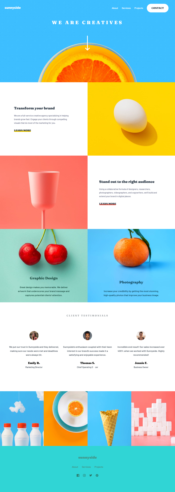

# Frontend Mentor - Sunnyside agency landing page solution

This is a solution to the [Sunnyside agency landing page challenge on Frontend Mentor](https://www.frontendmentor.io/challenges/sunnyside-agency-landing-page-7yVs3B6ef). Frontend Mentor challenges help you improve your coding skills by building realistic projects.

## Table of contents

- [Overview](#overview)
  - [The challenge](#the-challenge)
  - [Screenshot](#screenshot)
  - [Links](#links)
- [My process](#my-process)
  - [Built with](#built-with)
  - [What I learned](#what-i-learned)
  - [Continued development](#continued-development)
  - [Useful resources](#useful-resources)
- [Author](#author)

**Note: Delete this note and update the table of contents based on what sections you keep.**

## Overview

### The challenge

Users should be able to:

- View the optimal layout for the site depending on their device's screen size
- See hover states for all interactive elements on the page

### Screenshot



### Links

- Solution URL: [Add solution URL here](https://your-solution-url.com)
- Live Site URL: [Add live site URL here](sunnyside-landing-page-coral.vercel.app)

## My process

- Wireframe of the design
- Next, started with markup that is the structure of the page.
- styling the for markup
- finally interactive with javaScript

### Built with

- Semantic HTML5 markup
- CSS custom properties
- Media queries
- Flexbox
- Mobile-first workflow
- vanilla javaScript for mobile menu

### What I learned

```html 
<body>
  <header>
    some content
  </header>
</body>
```

```css
body {
  font-size: 18px;
}

header {
  font-size: 1rem;
}
```
### Continued development

I will continue to focus more on responsive web development using media queries and responsive font size using em and rem. I will like to switch from flexbox to grid for my layout designing because i found out during the course of this project that gird layout would have save me some time if i had implement this project using grid and not flex box. But flexbox this the work though.

### Useful resources

- [Example resource 1](https://www.medium.com/msinha2801) - This article helped me to understand more about to use em and rem for responsive font sizes. I would recommend this article to anybody having issue understanding how to us em and rem with.
- [Example resource 2](https://www.css-tricks.com) - This is an amazing forum which helped me understand better the concept of positioning element horizontally using css position property.

## Author

- Frontend Mentor - [@frontendgeek](https://www.frontendmentor.io/profile/frontendgeek)
- Twitter - [@frontEnd_guru](https://www.twitter.com/frontEnd_guru)


